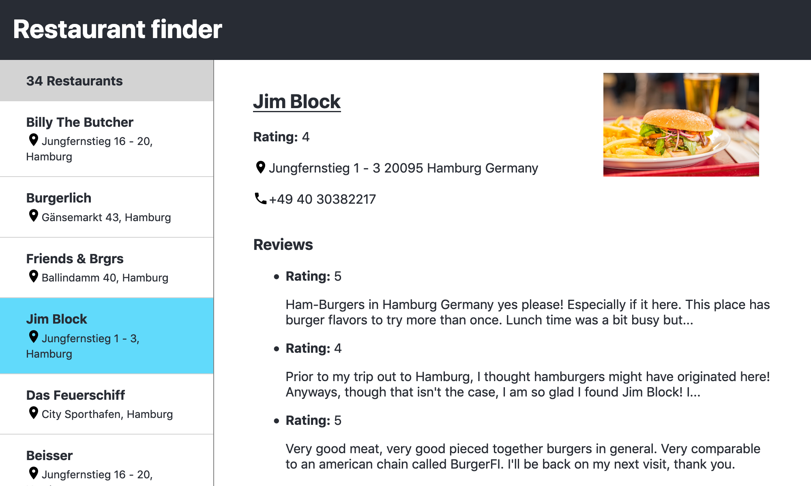

# Vue – Coding Challenge

## Task

* Create a Vue.Js single page that shows a list of restaurants in a navigation.
* The details of a restaurant are displayed by clicking on an entry in the
  navigation.
* Pick up the styles from the screenshot below.
* _Optional:_ The UI is displayed in light/dark depending on the user's
  preferred system settings.

### Sources

You will find all required sources in the `src/` directory. The data is in the
file `data.json`.

## Deliverables

Create a project on <https://codesandbox.io> and share the link of your result
with us.
